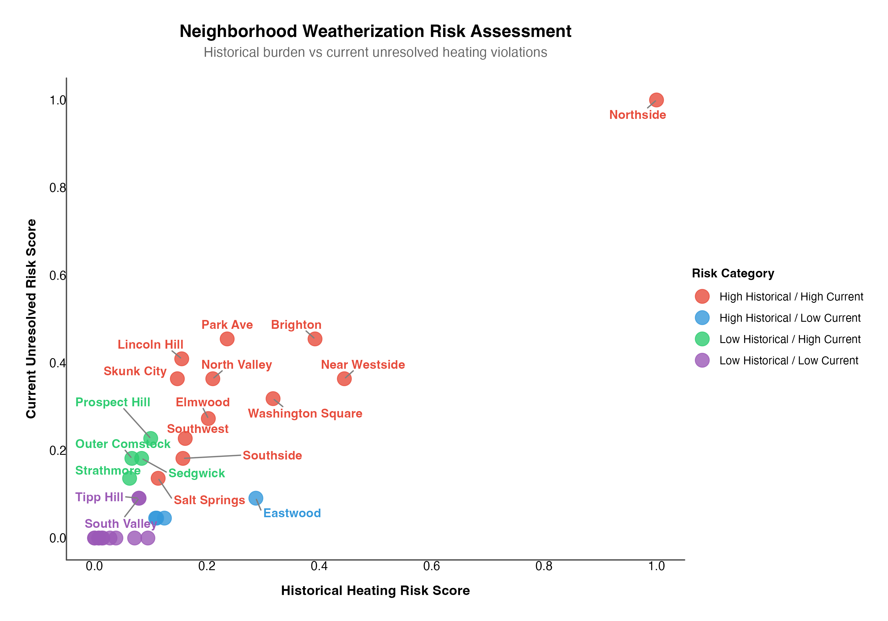

## Title: Analysing Weatherisation Risk across Syracuse Neighbourhoods:**

### Project Overview:

Syracuse experiences long and severe winters, with cold weather conditions lasting for a significant portion of the year. For many residents, especially those who are living in the older or rental housing, inadequate heating and poor building insulation can pose serious health and safety risk during winter months. 

The goal of the project is to identify Syracuse neighbourhoods that are most vulnerable to the **weatherisation risk** - defined as the **likelihood of facing heating related issues** during winter months. By analyzing historical heating code violations, currently unresolved heating risks, rental compliance, and neighborhood-level socioeconomic indicators, this project aims to highlight areas where residents may be disproportionately exposed to unsafe or unreliable heating conditions.

The **primary objective** is to support data-driven prioritization for the City of Syracuse by identifying neighborhoods that may benefit most from targeted weatherisation programs, inspections, or policy interventions. A **secondary objective** is to provide residents with greater visibility into the relative heating-related risk within their neighborhoods.

The key stakeholders for this analysis are city policymakers and housing officials, who can use these insights to allocate resources more effectively, and Syracuse residents, who may use this information to better understand heating-related risks in their communities.

**Key Metrics used for Risk Prioritisation**

To assess weatherszation risk across Syracuse neighborhoods, this project integrates three complementary layers of data: heating system reliability, rental compliance, and neighborhood vulnerability indicators.

**1.Heating Violation Metrics (Primary Risk Signal):** Heating-related code violations serve as the core indicator of weatherization risk.

a. Space heating system and water heating system violations
b. Total heating violations per neighborhood 
c. Open vs. closed violations, capturing both: Historical risk (past violations) and Current risk (open, unresolved violations)

📅 Violation data spans from 2017 to 2025, enabling both historical and current risk assessment.

**2. Rental Compliance Metrics (Housing Condition & Accountability):** Rental compliance data provides insight into the structural and regulatory condition of rental housing stock.

a. Total rental properties per neighborhood ( Rental Concentration)
b. Invalid rental registrations
c. Rental risk score, combining: Rental concentration and Rental non-compliance rate

This layer focuses only on rental properties, reflecting housing conditions for residents most dependent on landlord-maintained heating systems.

**3. Socioeconomic Vulnerability Indicators (Census Data):** Census-derived variables capture the capacity of residents to absorb heating failures and respond to winter conditions.

**I) Economic indicators:**  Median household income, Poverty rate (% of individuals below poverty line), SNAP participation rate (% of households receiving food assistance).
**II) Structural housing indicators:** Percentage of housing built before 1980, Percentage of housing built before 1960.

### Data Structure overview

The following diagram illustrates how five primary data sources are integrated to create the final analytical dataset:

**Figure 1: Entity-Relationship Diagram for Data Integration**

This diagram shows:
- **Raw Data Sources** (top): Code Violations, Rental Registry, Census DP03/DP04, Neighborhood Geography
- **Mapping Tables** (middle): SBL-to-Neighborhood and Census Tract-to-Neighborhood mappings
- **Aggregated Metrics** (lower middle): Heating metrics, Rental compliance, Census features by neighborhood
- **Final Dataset** (bottom): WEATHERIZATION_FULL master dataset with all vulnerability scores

All data is standardized to the neighborhood level (n=50) through direct aggregation, SBL-based joins, and spatial joins.

## Executive Summary

1. A small group of Syracuse neighborhoods face both high historical heating violations and high current unresolved risk, placing them in the highest-priority category for weatherization intervention. Northside stands out as the most extreme case.

2. This quadrant view highlights where risk is persistent versus improving, helping policymakers distinguish between neighborhoods with chronic heating issues and those where conditions are stabilizing.

3. Further analysis of rental compliance and census data shows that neighborhoods in the high-risk quadrants also tend to have higher rental non-compliance and greater economic vulnerability, suggesting that heating risk is closely linked to housing conditions and socio-economic stressors.

4. Together, these findings support a targeted approach to weatherization, focusing first on neighborhoods with both sustained heating violations and structural or economic risk factors.

## Insights Deep Dive: 

