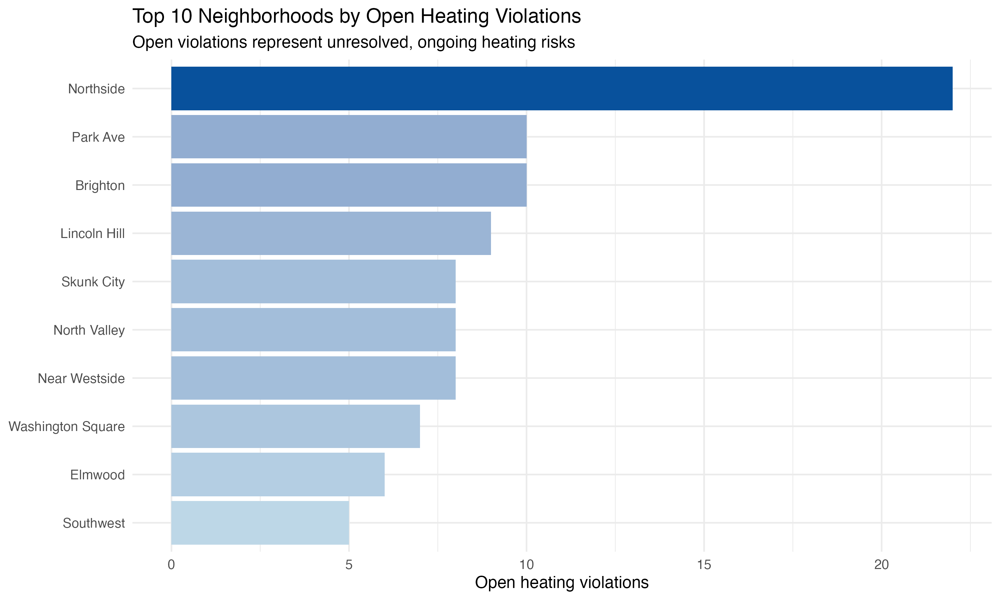
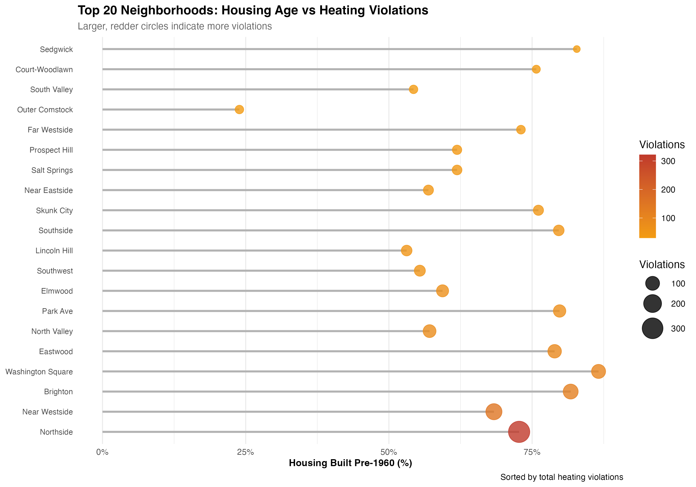
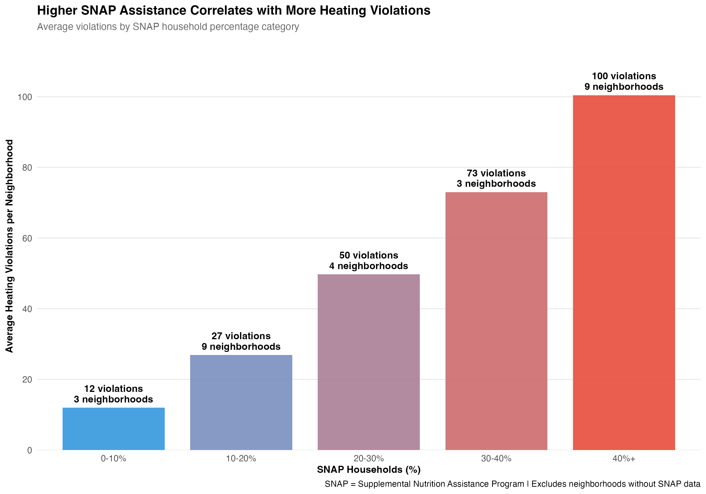
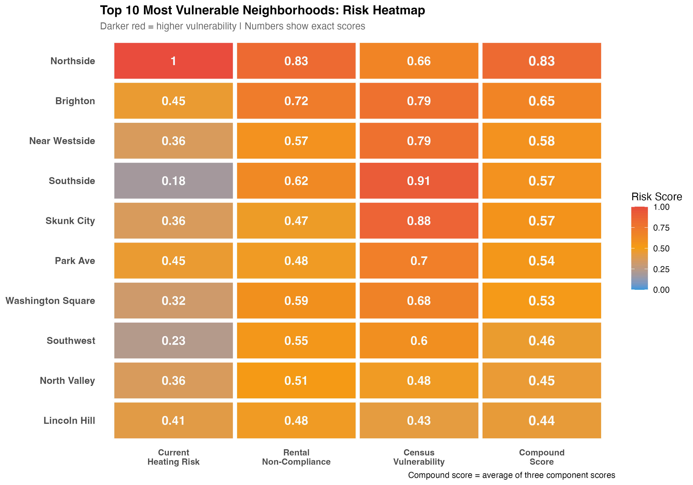

# Title: Analysing Weatherisation Risk across Syracuse Neighbourhoods:

## Project Overview:

Syracuse experiences long and severe winters, with cold weather conditions lasting for a significant portion of the year. For many residents, especially those who are living in the older or rental housing, inadequate heating and poor building insulation can pose serious health and safety risk during winter months. 

The goal of the project is to identify Syracuse neighbourhoods that are most vulnerable to the **weatherisation risk** - defined as the **likelihood of facing heating related issues** during winter months. By analyzing historical heating code violations, currently unresolved heating risks, rental compliance, and neighborhood-level socioeconomic indicators, this project aims to highlight areas where residents may be disproportionately exposed to unsafe or unreliable heating conditions.

The **primary objective** is to support data-driven prioritization for the City of Syracuse by identifying neighborhoods that may benefit most from targeted weatherisation programs, inspections, or policy interventions. A **secondary objective** is to provide residents with greater visibility into the relative heating-related risk within their neighborhoods.

The key stakeholders for this analysis are city policymakers and housing officials, who can use these insights to allocate resources more effectively, and Syracuse residents, who may use this information to better understand heating-related risks in their communities.

### Key Metrics used for Risk Prioritisation

To assess weatherszation risk across Syracuse neighborhoods, this project integrates three complementary layers of data: heating system reliability, rental compliance, and neighborhood vulnerability indicators.

**1.Heating Violation Metrics (Primary Risk Signal):** Heating-related code violations serve as the core indicator of weatherization risk.

a. Space heating system and water heating system violations

b. Total heating violations per neighborhood 

c. Open vs. closed violations, capturing both: Historical risk (past violations) and Current risk (open, unresolved violations)

📅 Violation data spans from 2017 to 2025, enabling both historical and current risk assessment.

**2. Rental Compliance Metrics (Housing Condition & Accountability):** Rental compliance data provides insight into the structural and regulatory condition of rental housing stock.

a. Total rental properties per neighborhood ( Rental Concentration)

b. Invalid rental registrations

c. Rental risk score, combining: Rental concentration and Rental non-compliance rate (RR - InvalidRate)

This layer focuses only on rental properties, reflecting housing conditions for residents most dependent on landlord-maintained heating systems.

**3. Socioeconomic Vulnerability Indicators (Census Data):** Census-derived variables capture the capacity of residents to absorb heating failures and respond to winter conditions.

**I) Economic indicators:**  Median household income, Poverty rate (% of individuals below poverty line), SNAP participation rate (% of households receiving food assistance).
**II) Structural housing indicators:** Percentage of housing built before 1980, Percentage of housing built before 1960.

## Data Structure overview

The following diagram illustrates how five primary data sources are integrated to create the final analytical dataset:

**Figure 1: Entity-Relationship Diagram for Data Integration**

This diagram shows:
- **Raw Data Sources** (top): Code Violations, Rental Registry, Census DP03/DP04, Neighborhood Geography
- **Mapping Tables** (middle): SBL-to-Neighborhood and Census Tract-to-Neighborhood mappings
- **Aggregated Metrics** (lower middle): Heating metrics, Rental compliance, Census features by neighborhood
- **Final Dataset** (bottom): WEATHERIZATION_FULL master dataset with all vulnerability scores

All data is standardized to the neighborhood level (n=50) through direct aggregation, SBL-based joins, and spatial joins.

## Executive Summary

1. A small group of Syracuse neighborhoods face both high historical heating violations and high current unresolved risk, placing them in the highest-priority category for weatherization intervention. Northside stands out as the most extreme case.

2. This quadrant view highlights where risk is persistent versus improving, helping policymakers distinguish between neighborhoods with chronic heating issues and those where conditions are stabilizing.

3. Further analysis of rental compliance and census data shows that neighborhoods in the high-risk quadrants also tend to have higher rental non-compliance and greater economic vulnerability, suggesting that heating risk is closely linked to housing conditions and socio-economic stressors.

4. Together, these findings support a targeted approach to weatherization, focusing first on neighborhoods with both sustained heating violations and structural or economic risk factors.

## Insights Deep Dive: 

### Top 10 Neighborhoods wiht highest total heating violations

This chart highlights the top 10 Syracuse neighborhoods with the highest number of heating-related violations reported between 2017 and 2025.

**Key takeaway**

1. Northside stands out clearly, with more than double the heating violations of any other neighborhood.

2. A small group of neighborhoods (Northside, Near Westside, Brighton, Washington Square) accounts for a disproportionately large share of heating issues.

3. This suggests that heating-related risk is not evenly distributed across the city, but concentrated in specific areas.

**Why this matters** These neighborhoods represent priority areas for weatherization efforts and enforcement. Targeting interventions in a small number of high-risk neighborhoods could have a large impact on resident safety and comfort.

### Top 10 neighbourhoods with highest open violations:

When we compare current open heating violations with historical total heating violations, we see a strong overlap across several neighborhoods. The neighborhoods that appear in both lists are:

Northside, Park Ave, Brighton, Lincoln Hill, North Valley, Near Westside, Washington Square, Elmwood, and Southwest.

This overlap is important because it shows neighborhoods where heating issues are persistent over time, not just temporary spikes. In contrast, Eastwood appears mainly in historical violations (suggesting some improvement), while Skunk City appears only in current open violations (indicating a more recent or emerging issue).

**Key takeaway:**

Neighborhoods that rank high in both historical and current open heating violations represent the highest priority for intervention, as they face long-standing heating challenges that remain unresolved today. Targeting these areas can help the city address both legacy issues and ongoing resident safety concerns more effectively.

### Rental Non-Compliance vs Heating Violations - A scatter plot: 

This scatter plot shows a clear positive relationship between rental non-compliance rates and total heating violations across neighborhoods. Neighborhoods with higher percentages of non-compliant rental properties tend to report more heating violations, with Northside, Near Westside, Brighton, and Washington Square standing out as areas where both values are high.

This aligns strongly with the correlation analysis, where the rental risk score showed the strongest positive correlation with total heating violations among all variables examined. This indicates that rental non-compliance is not just associated with heating problems—it is likely a key structural driver of weatherization risk in the city.

**Why this matters:**

Improving rental compliance—through inspections, enforcement, or landlord support—may be one of the most effective levers available to reduce heating-related risks and improve resident safety, especially in neighborhoods with persistently high violation counts.

### Housing Age vs Heating Violations:  

Neighborhoods with a higher share of older homes (built before 1960) tend to have more heating violations.

1. High-risk neighborhoods like Northside, Near Westside, Brighton, and Washington Square have both older housing stock and higher violation counts.

2. Older buildings are more likely to have outdated heating systems, poor insulation, and deferred maintenance, increasing winter heating issues.

**Why this matters:**

Housing age helps explain why certain neighborhoods consistently face heating problems and highlights where weatherization upgrades could have the biggest impact.

## SNAP % VS Heating Violations:

As the percentage of households receiving SNAP increases, the average number of heating violations also increases.

1.Neighborhoods with 40%+ SNAP participation have the highest average heating violations.

2.Neighborhoods with lower SNAP percentages show significantly fewer violations.

**What this tells us:**

Heating risk is not just a housing issue — it is also closely linked to economic vulnerability. Areas with higher SNAP usage may have less ability to afford repairs, making them more exposed during winter.

## HeatMap of 

This heatmap brings together all the major risk factors into one view to identify the most vulnerable neighborhoods.

Each row is a neighborhood, and each column represents a different type of risk:

**Current Heating Risk** → ongoing, unresolved heating issues

**Rental Non-Compliance** → proportion of rental units failing inspections

**Census Vulnerability** → socioeconomic vulnerability (income, SNAP, poverty)

**Compound Score** → average of all three (overall risk)

**Darker red cells indicate higher risk.**

**Key Insights from the Heatmap:**

1.Northside clearly stands out as the most vulnerable neighborhood, scoring high across all three dimensions, resulting in the highest overall risk score.

2.Brighton, Near Westside, and Southside also show consistently elevated risk, driven by a combination of housing issues and socioeconomic vulnerability.

3.Some neighborhoods (e.g., Southside, Skunk City) have moderate current heating risk but very high census vulnerability, indicating residents may be less able to recover from heating failures.

4.Lower-ranked neighborhoods show more balanced or lower scores, suggesting fewer compounding risk factors.

**NOTE:**

The census vulnerability score was calculated as the average of three normalized indicators: percentage of SNAP households, poverty rate, and share of housing built before 1960. The rental risk score represents a scaled version of the rental non-compliance rate (percentage of rental properties failing inspection), allowing it to be compared with other risk measures. The final compound risk score is the average of current heating risk, rental risk, and census vulnerability scores.

## Recommendations

Based on the combined risk assessment across heating violations, rental non-compliance, and socioeconomic vulnerability, the following actions are recommended:

### 1. Prioritize High-Risk Neighborhoods for Weatherization Funding

Neighborhoods such as Northside, Brighton, Near Westside, and Southside consistently rank high across multiple risk dimensions. These areas should be prioritized for:

1.Targeted weatherization assistance programs

2.Preventive heating system upgrades before winter months

3.Increased inspection frequency during peak winter periods

### 2. Focus on Rental Properties with Repeated Non-Compliance

The strong positive correlation between rental non-compliance and heating violations suggests that enforcement and support efforts should focus on rental units, especially those with repeated inspection failures.
Recommended actions include:

1.Proactive follow-ups on failed rental inspections

2.Incentives or penalties tied to timely compliance

3.Coordination with landlords to address systemic heating issues

### 3. Integrate Socioeconomic Vulnerability into Planning Decisions

Neighborhoods with high SNAP participation and poverty levels experience higher heating risk, even when violation counts are moderate.
Policy decisions should:

Consider residents’ ability to self-remediate heating issues

Pair infrastructure improvements with resident support programs

Use census vulnerability metrics when allocating limited resources

